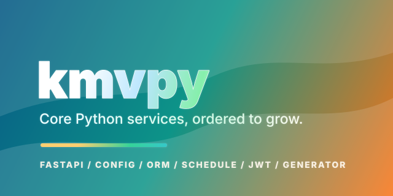

# KMVPy

<p align="center">
  
</p>

<p align="center">
  
</p>

基于 **FastAPI** 的服务端基础库：YAML 驱动配置、异步 SQLAlchemy 领域层、统一响应与异常、JWT、APScheduler 调度、Socket.IO，以及 **工程脚手架**（Python + 前端子项目、YAML 冒烟测试骨架）。默认依赖已包含 Web、异步 SQLite/PostgreSQL、Redis、Cassandra 驱动、PyJWT、OpenAI SDK 等；**MySQL** 需额外可选依赖。

## 核心模块（框架能力）

| 模块 | 职责 |
|------|------|
| **`kmvpy.core.main`** | ASGI 入口：`init_asgi_app` 聚合路由、日志、i18n、Socket.IO、全局异常；`lifespan` 初始化/释放 DB·Redis 等资源；`get_config_path` 解析配置路径。文档字符串中含「启动时按 ORM 建表/演进」的接入说明（`init_tables_by_orms` + 异步驱动约束）。 |
| **`kmvpy.common.conf`** | `BaseConfig`（YAML → Pydantic）：库表连接、Redis、日志、服务/CORS、Socket.IO、鉴权（JWT，可按用户类型拆分）、可选首个管理员、`SnowflakeConfig` 与 KSnowflake 等。 |
| **`kmvpy.common.infra`** | `KOrmStorage` + `KOrmBase`：异步会话、分页与安全排序、缓存协作等 ORM 语义；雪花 ID（`KSnowflake`）。 |
| **`kmvpy.common.response`** | `ApiResponse` / `SocketioResponse`：统一 JSON 成功与错误形态，与 `KmvException`、错误码衔接。 |
| **`kmvpy.common.exception`** | `KmvException`、`KmvError`：业务错误码与文案约定。 |
| **`kmvpy.common.schedule`** | 基于 APScheduler 的异步调度：`ScheduleManager`、`schedule_task` 装饰器、全局调度器生命周期（与 ASGI 启动挂钩）。 |
| **`kmvpy.common.kmv`** | `kosmos`：进程内配置、Socket.IO 等既有运行态挂载点；Storage 由应用显式持有并传给 `init_asgi_app`。 |
| **`kmvpy.common.st`** | 冒烟测试骨架：`StBasePyTest`、`StTestCase`、YAML 步骤与期望（供生成工程中的 `st_test` 使用）。 |
| **`kmvpy.core.main.service`** | JWT（多算法、用户信息载体等，详见模块）。 |
| **`kmvpy.core.main.router`** | Socket.IO 与 FastAPI 应用绑定。 |
| **`kmvpy.generator`** | CLI：`kmvpy create` / `kmvpy update` / `kmvpy rotate-jwt-keys`，生成工程并支持 JWT 密钥轮换；详见 `kmvpy/generator/README.md`。 |

## 默认依赖与可选

- **声明位置：** `pyproject.toml`（PEP 517 / PEP 621，setuptools 构建后端）。
- **可选：** `[project.optional-dependencies]` 中目前为 **`mysql`**（`mysqlclient`、`aiomysql` 等）；其余 Web/Redis/SocketIO 等在默认 `dependencies` 中。

## 技术栈（节选）

FastAPI · Uvicorn · Pydantic v2 · SQLAlchemy 2（异步）· Redis · APScheduler · python-i18n · PyYAML · PyJWT · fastapi-socketio · asyncpg / aiosqlite · cassandra-driver · OpenAI SDK

## 典型用途

REST/实时混合 API、统一配置与错误契约的微服务底座、需要脚手架一键拉出前后端目录与冒烟测试模板的团队。

---

## 安装与使用

**环境：** Python ≥ 3.11  

> **发布状态（2026-09-08）：** PyPI 的项目接口当前没有找到 `kmvpy`，但本仓库尚未完成首发；在首个版本真正发布前，请使用下面的本地安装方式。维护者操作见 [PyPI 首次发布指南](https://github.com/kmvdata/kmvpy/blob/develop/docs/PUBLISHING.md)。

**本地安装：** `pip install .` · 开发：`pip install -e .` · 使用 MySQL：`pip install ".[mysql]"`

**PyPI 安装（首发完成后）：** `pip install kmvpy` · 使用 MySQL：`pip install "kmvpy[mysql]"`

**构建：** `python -m pip install -U build twine && python -m build && python -m twine check --strict dist/*` → 产物在 `dist/`；分发/安装优先 **wheel**。仅从 `tar.gz` 离线安装且避免拉取构建依赖时：`pip install --no-build-isolation --no-deps dist/kmvpy-0.2.1.tar.gz`。

**脚手架与运维命令：** `kmvpy create <名称> [-d 父目录]` · `kmvpy update …` · `kmvpy rotate-jwt-keys path/to/config.yaml`

**快速校验：**

```bash
python -c "from kmvpy.core.main.service.jwt_service import JwtUserInfo; print(JwtUserInfo)"
```

**示例：**

```python
import kmvpy
from kmvpy.common.tool.logger import logger, init_logger

init_logger(debug=True)
logger.info("ok")

# from kmvpy.common.conf import BaseConfig
# config = BaseConfig.load_config("path/to/config.yaml")

# from kmvpy.core.main import init_asgi_app, get_config_path
# app = init_asgi_app(BaseConfig.load_config(get_config_path()), routers=[...])
```

### Redis ACL 配置

所有 Redis 配置（`default_storage.redis`、兼容旧工程的顶层 `redis`、`auth_config.user.redis`、`auth_config.admin.redis`）均支持可选的 `username`：

```yaml
redis:
  host: localhost
  port: 6379
  db: 0
  username: app_user
  password: "your-redis-password"
  decode_responses: true
```

将该片段放在对应配置层级下。配置 `username` 时使用 ACL 用户名和密码认证；省略 `username`、设为 `null` 或空字符串时，保持现有仅密码认证方式，无需修改旧配置。脚手架生成的 Socket.IO Redis 客户端和分布式消息转发连接同样支持 ACL。

### 打包与本地安装（详细）

以下命令默认在仓库根目录（含 `pyproject.toml`）执行；构建由 setuptools 以 PEP 517 方式驱动，产物统一输出到 `dist/`。首次构建需要联网获取构建工具依赖（`setuptools`、`wheel`），之后的重复构建会命中本地缓存。

**① 准备构建与校验工具（一次性）**

```bash
python -m pip install -U pip build twine
```

**② 清理旧产物并构建**

```bash
rm -rf build dist *.egg-info
python -m build
python -m twine check --strict dist/*
```

产物（版本号以 `kmvpy/__init__.py` 的 `__version__` 为唯一来源，当前 `0.2.1`；发新版前先递增）：

| 产物 | 说明 | 建议用途 |
|------|------|----------|
| `dist/kmvpy-0.2.1-py3-none-any.whl` | wheel，纯 Python、无平台限制 | **首选**：安装、交付、离线分发 |
| `dist/kmvpy-0.2.1.tar.gz` | sdist 源码包 | 审计源码、二次打包 |

wheel 已随包携带脚手架模板与 nginx 模板（由 `MANIFEST.in` + `include-package-data` 收集），因此安装后 `kmvpy create / update` 即可直接生成或更新工程，无需再从仓库手动拷贝模板。

**③ 本地安装（任选其一）**

方式 A：从源码目录直接安装（现场构建后装入当前环境）

```bash
pip install .
# 需要 MySQL 驱动（mysqlclient / aiomysql）时：
pip install ".[mysql]"
```

方式 B：可编辑安装（开发调试推荐：代码改动即时生效，无需反复重装）

```bash
pip install -e .
pip install -e ".[mysql]"
```

方式 C：安装已构建的 wheel（交付 / CI / 离线分发推荐）

```bash
pip install dist/kmvpy-0.2.1-py3-none-any.whl
```

方式 D：从 sdist 离线安装（环境已具备全部运行依赖、又不想拉取构建依赖时，跳过构建隔离与依赖解析）

```bash
pip install --no-build-isolation --no-deps dist/kmvpy-0.2.1.tar.gz
```

> 注意：方式 D 的 `--no-deps` 不会自动安装任何运行依赖；若环境缺依赖，请改用方式 A/C（或先补齐依赖）。

建议先创建虚拟环境再安装，避免污染全局 Python：

```bash
python -m venv .venv
source .venv/bin/activate    # Windows: .venv\Scripts\activate
```

**④ 安装后验证**

```bash
python -c "from kmvpy.core.main.service.jwt_service import JwtUserInfo; print(JwtUserInfo)"
kmvpy --help
```

卸载：`pip uninstall kmvpy`；重装前建议先卸载再执行上述任一安装命令。

## JWT 密钥配置

JWT 只支持非对称算法白名单（默认 `RS256`）。配置文件中禁止保存 PEM 内容，只能引用部署系统注入的只读密钥文件路径；启动时会校验路径、PEM 合法性、`kid` 唯一性、active 私钥与 active 公钥是否匹配。

```yaml
auth_config:
  user:
    jwt:
      algorithm: "RS256"
      active_kid: "user-20050607"
      private_key_path: "/run/secrets/signal-tracker/jwt-private-user-20050607.pem"
      public_keys:
        - kid: "user-20050607"
          public_key_path: "/run/secrets/signal-tracker/jwt-public-user-20050607.pem"
        - kid: "user-20050301"
          public_key_path: "/run/secrets/signal-tracker/jwt-public-user-20050301.pem"
      issuer: "kmvpy"
      audience: "kmvpy-user-api"
      access_token_lifetime_hours: 0.25
```

轮换方式：把新私钥路径配置为 `private_key_path`，把 `active_kid` 切到新 `kid`，并在 `public_keys` 中同时保留新旧公钥。确认旧 token 过期后移除旧公钥，旧 `kid` token 会自动验签失败。

也可以用 kmvpy CLI 自动完成一次 user/admin 密钥轮换：

```bash
kmvpy rotate-jwt-keys app/etc/release/config.yaml
```

该命令会读取当前 `private_key_path` 和 active 公钥的 `public_key_path` 所在目录，生成新的私钥/公钥 PEM 文件，生成随机 `active_kid`，把新公钥插入 `public_keys`，并备份原配置文件。旧公钥文件存在时最多额外保留 1 组用于过渡验签；旧公钥文件不存在时会从配置中移除，只采用新生成的公钥。若配置缺少 `auth_config` 或 user/admin JWT 片段，会按 RS256、默认 issuer/audience/lifetime/session/redis 规格补齐，并将密钥生成到配置文件所在目录的 `./secrets`。

生产挂载建议：

- Ubuntu 真机：密钥放在 `/etc/<app>/secrets/jwt-private-user-20050607.pem` 或 `/run/secrets/<app>/jwt-private-user-20050607.pem`，私钥建议 `0400`，属主为运行服务的用户，配置中只写路径。
- Docker：用 Docker secrets 或只读 bind mount 挂到 `/run/secrets/<app>/jwt-private-user-20050607.pem` 这类扁平文件路径，容器内配置引用挂载后的路径。
- K8s：用 Secret projected volume 或 CSI Secret Store 只读挂载到 `/run/secrets/<app>/jwt-private-user-20050607.pem` 这类扁平文件路径；K8s 默认文件模式可能较宽，kmvpy 会告警，存在组/其他用户写权限或执行位时生产环境会拒绝启动。

细节与生成工程约定见 `kmvpy/generator/README.md` 及各包内文档字符串。
